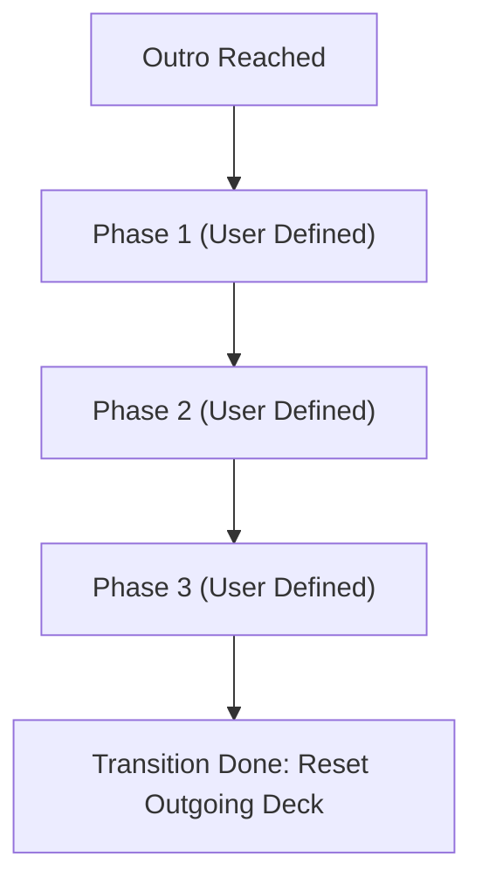

# AuraMix Web Auto-DJ 🎧
> Intelligent real-time audio mixer and autonomous Auto-DJ engine running entirely in the browser using the Web Audio API and React.

AuraMix is an interactive web-based DJ application that allows users to upload local music files (or load demo tracks) to analyze them in real-time and perform seamless manual or automated harmonic transitions between two independent decks (Deck A and Deck B). 

The system utilizes client-side Digital Signal Processing (DSP) to detect the tempo (BPM), musical key (Camelot Code), and optimal entry (Intro/Drop) and exit (Outro) points. Using this analysis, the Auto-DJ engine matches the tempo, aligns the beats, and executes a smooth 3-phase EQ transition at a constant volume level to maintain mixing momentum.

---

## 📋 Table of Contents
- [Key Features](#-key-features)
- [Technology Stack](#-technology-stack)
- [How It Works Under the Hood (DSP & Audio Analysis)](#-how-it-works-under-the-hood-dsp--audio-analysis)
  - [1. BPM (Tempo) Detection](#1-bpm-tempo-detection)
  - [2. Musical Key Detection (Camelot Scale)](#2-musical-key-detection-camelot-scale)
  - [3. Intro / Drop Detection](#3-intro--drop-detection)
  - [4. Outro Detection](#4-outro-detection)
  - [5. Harmonic Compatibility (Camelot Wheel)](#5-harmonic-compatibility-camelot-wheel)
- [Auto-DJ Transition Engine](#-auto-dj-transition-engine)
  - [Tempo Matching (Pitch Matching)](#tempo-matching-pitch-matching)
  - [Rhythmic Alignment (Beat Grid Alignment)](#rhythmic-alignment-beat-grid-alignment)
  - [3-Phase EQ & Volume Transition](#3-phase-eq--volume-transition)
- [Project Architecture & Directory Structure](#-project-architecture--directory-structure)
- [Prerequisites & Installation](#-prerequisites--installation)
- [Usage Guide](#-usage-guide)
- [Troubleshooting](#-troubleshooting)

---

## ✨ Key Features

*   **Dual Players (Decks A & B):** Independent playback controllers with real-time waveform visualization rendered on HTML5 `<canvas>`.
*   **Local Audio Analysis:** Client-side decoding and analysis of user-uploaded files (100% private, zero server uploads).
*   **Camelot Harmonic Analysis:** Analyzes musical key compatibility and renders a visual Camelot Wheel on the sidebar.
*   **Intelligent Auto-DJ Engine:** Monitors the playing deck and, upon reaching the Outro point, loads a compatible track from the library into the free deck, syncs its BPM, performs high-precision beatmatching phase alignment, and triggers the transition.
*   **Complete Manual Mixer:**
    *   Three-band rotary EQs per channel (Lows, Mids, Highs).
    *   High-resolution pitch/speed faders with a range of ±10% (matching Pioneer CDJ industry standard).
    *   Channel volume faders aligned vertically next to EQs for direct channel mixing.
    *   Master BPM selector (defaulting to 128 BPM) that automatically locks loaded track speeds.
    *   **Phase & BPM SYNC Controls:** A central sync button between the decks to align beat phases ($\theta$ compás alignment) and BPMs in real-time, resolving any phase drift.
*   **Draggable EQ Precedence Pills:** Dynamic 3-phase transition reordering. Choose which frequency band (LOWS, MIDS, HIGHS) is mixed 1st, 2nd, and 3rd using native drag-and-drop.
*   **Audio-Rhythmic Pulsating Glow:** Decks pulse and glow in sync with the beat of the song using a cubic decay algorithm, providing direct visual feedback for beatmatching.
*   **Played Track Indicators:** Displays a warning indicator badge `!` next to already played tracks in the library list to prevent repeat track selections.
*   **Manual Override Support:** Auto-DJ respects user-selected tracks loaded onto the incoming deck instead of automatically overwriting them.
*   **Always-Visible Alert Banner with Neon Animation:** The "Mezcla en curso" label stays visible (styled as "MEZCLA INACTIVA" in a dimmed, greyed-out offline state when idle) and activates with a flickering neon ignition animation on transition start, transitioning through colors matching the current EQ precedence phase (Cyan/Purple/Pink), and fading out smoothly back to the idle state on completion.
*   **Premium Cyberpunk Design:** Glassmorphic UI styled with neon cyan, pink, and orange accents, premium typography (*Outfit* and *Space Grotesk*), and smooth micro-animations.
*   **DJ Activity Log Console:** Real-time ticker displaying the mathematical and logical steps taken by the mixer and Auto-DJ engines.

---

## 🛠️ Technology Stack

*   **Core Library:** [React 18 (Vite)](https://react.dev/)
*   **Audio Engine:** Web Audio API (`AudioContext`, `OfflineAudioContext`, `BiquadFilterNode` for EQs, `GainNode` for volume/crossfade, `AudioBufferSourceNode` for source playback).
*   **Icons:** [Lucide React](https://lucide.dev/)
*   **Styling:** Vanilla CSS3 with CSS variables, backdrop blur filters, and neon glows.
*   **Typography:** *Outfit* (titles and UI) and *Space Grotesk* (metrics and stats).

---

## 🔬 How It Works Under the Hood (DSP & Audio Analysis)

The file [`src/utils/audioAnalyzer.js`](file:///d:/dev/AuraMix/src/utils/audioAnalyzer.js) is the analytical core of AuraMix. It implements mathematics and DSP algorithms on client-side audio data:

### 1. BPM (Tempo) Detection
To identify a track's tempo (BPM):
1.  **Downsampling:** Audio is processed inside an `OfflineAudioContext` resampled to **22,050 Hz** to decrease buffer size and accelerate calculations.
2.  **Transient Isolation (Lowpass Filter):** The signal is passed through a `lowpass` filter with a cutoff frequency of **150 Hz** and a Q factor of 1.0. This isolates the kick drum hits, which define the rhythm in dance music.
3.  **Peak Detection:** Finds the maximum absolute amplitude and sets a dynamic threshold (60% of the maximum amplitude). Peaks exceeding this threshold, spaced at least 0.25 seconds apart (equivalent to an upper limit of 240 BPM), are recorded as rhythmic hits.
4.  **Interval Histogram:** Measures the distance (in samples) between consecutive peaks and converts them to candidate BPMs. Candidate BPMs are normalized to the DJ-standard range of **75 to 150 BPM** by doubling or halving the value. A histogram is built, and the BPM with the highest occurrence (smoothed with adjacent values) is defined as the track tempo.

### 2. Musical Key Detection (Camelot Scale)
To detect the musical key for harmonic mixing:
1.  **Hann Windowing & FFT:** Extracts 8 audio windows from the center of the track (from 30% to 70% of total duration) to avoid silent intros or outros. A Hann window function is applied to each **4096-sample** window, and a **Fast Fourier Transform (FFT)** is calculated using a radix-2 Cooley-Tukey algorithm implemented in pure JavaScript.
2.  **Chromagram Extraction (Chroma Vector):** For each frequency bin in the audible range of standard instruments (50 Hz to 2000 Hz), the spectral magnitude is calculated and mapped to its respective MIDI note ($f \rightarrow \text{Note}$). Energies are accumulated into a 12-element vector (one for each semitone in the chromatic scale: C, C#, D... B). The chroma vector is normalized by dividing each element by the maximum value.
3.  **Key Profile Correlation (Krumhansl-Schmuckler):** The chroma vector is rotated through all 12 transpositions and correlated against standard Krumhansl-Schmuckler key profile templates for major (`KS_MAJOR`) and minor (`KS_MINOR`) scales. The scale with the highest Pearson correlation coefficient determines the key (e.g., *C Minor*).
4.  **Camelot Mapping:** The physical key is mapped to its equivalent Camelot code (e.g., *C Minor* $\rightarrow$ `5A`, *C Major* $\rightarrow$ `8B`) via a dictionary lookup (`CAMELOT_MAP`).

### 3. Intro / Drop Detection
The entry point ("drop") is where the energy rises significantly after a quiet or progressive introduction:
*   The first 120 seconds (2 minutes) of the song are scanned in 1-second blocks.
*   Calculates the root-mean-square (**RMS**) energy of each block.
*   Measures the energy delta between consecutive blocks. The intro/drop point is identified at the largest positive energy delta, provided the subsequent 4 seconds maintain an energy level above 80% of the track's average (ensuring it's not a temporary peak).

### 4. Outro Detection
The exit point ("outro") is where the track begins to fade out or lose rhythmic elements:
*   Scans the final 2 minutes of the track in 1-second blocks.
*   Calculates the **RMS** of each block and identifies the peak RMS in this end region.
*   Locates the first block (moving chronologically) where energy decays below **22% of the peak RMS** and remains below 35% for the rest of the song. This point is marked as the Outro mixing point.

### 5. Harmonic Compatibility (Camelot Wheel)
Two tracks are harmonically compatible if their Camelot keys are adjacent on the Camelot wheel. The system validates this in the function [`areKeysCompatible`](file:///d:/dev/AuraMix/src/utils/audioAnalyzer.js#L430-L449):
*   **Exact Key Match:** e.g., `8A` and `8A` (perfect mix).
*   **Numerically Adjacent Keys:** e.g., `8A` and `9A` (energy boost), `8A` and `7A` (energy drop). The wheel handles circular transitions between `12` and `1`.
*   **Relative Major/Minor Swap:** Swapping letters while keeping the same number, e.g., `8A` (A minor) and `8B` (C major).

### 6. Tempo/BPM Compatibility
To ensure natural sound quality and prevent extreme pitch bending when mixing, the system enforces a strict tempo difference threshold. Tracks are considered compatible if:
*   The original BPM of the target track is within **±5%** of the currently playing track's BPM.
*   This ensures that the pitch fader adjustment (limited to the ±10% Pioneer standard) can lock the BPMs without causing unwanted vocal or instrumental distortion.
*   Incompatible tracks are visually dimmed in the library list, indicating they are not recommended for automated or manual transitions.

---

## 🎛️ Auto-DJ Transition Engine

When the playing deck reaches the Outro point of the current track, it triggers the automated mixing sequence in the background. The core scheduling logic is managed by [`triggerAutomatedTransition`](file:///d:/dev/AuraMix/src/hooks/useAudioEngine.js#L218-L439):

### Tempo Matching (Pitch Matching)
The engine reads the original BPM of the playing track (`fromBpm`) and the incoming track (`toBpm`). It calculates the speed adjustment ratio to align them to the global Master BPM:
$$\text{pitchOffset} = \frac{\text{MasterBPM} - \text{toBpm}}{\text{toBpm}} \times 100$$
This percentage is applied to the incoming deck's pitch fader and assigned directly to the audio node: `source.playbackRate.value = 1 + (pitchOffset / 100)`.

### Rhythmic Alignment (Beat Grid Alignment)
To prevent clashing drumbeats (known as "trainwrecking"):
1.  Calculates the beat duration in seconds for the active track: `beatDuration = 60 / fromBpm`.
2.  Computes the precise playback position in microseconds using the AudioContext clock: `elapsed = currentTime - startTime`.
3.  Calculates the phase offset: `beatOffset = highPrecisionTime % beatDuration`.
4.  Calculates the delay to align the incoming deck's first beat with the next beat of the active deck: `delay = beatDuration - beatOffset`.
5.  Schedules a synchronized start: `source.start(AudioContext.currentTime + delay)`.

### 3-Phase EQ & Volume Transition
Once the incoming deck starts in phase, the mixer executes a gradual 3-stage automated EQ transition over the transition duration (calculated dynamically as the minimum between the outgoing track's remaining outro duration and the incoming track's intro duration). This ensures that the transition fits perfectly within the musical boundaries of both tracks. The order of the EQ band mixing is fully customizable dynamically via the draggable EQ precedence pills. Throughout this process, total volume levels are maintained to ensure mixing momentum is not lost:



*   **Initialization:** The incoming deck starts playing at full volume (`volume = 1.0`), but its EQ nodes are initialized fully attenuated (`low = -40dB`, `mid = -40dB`, `high = -40dB`) to avoid muddying the master signal.
*   **Dynamic Phase Ordering:** The mixing sequence is calculated using the custom user-selected `eqOrder` configuration:
    *   **Mids Swap (`MIDS`):** Leads, vocals, and melodies crossover. The incoming deck's mids rise from -40dB to 0dB, while the outgoing deck's mids drop to -40dB.
    *   **Lows Swap (`LOWS`):** Kick drum and bassline crossover. The incoming deck's bass rises from -40dB to 0dB, while the outgoing deck's bass drops to -40dB.
    *   **Highs Swap (`HIGHS`):** Hi-hats, percussions, and groove crossover. The incoming deck's treble rises from -40dB to 0dB, while the outgoing deck's treble drops to -40dB.
*   **Completion:** The outgoing deck is stopped, its EQs and volumes are reset to defaults, and the crossfader is centered on the new active deck.

---

## 📁 Project Architecture & Directory Structure

AuraMix uses a modular React architecture where audio routing, state management, and component views are decoupled:

```
AuraMix/
├── public/                 # Static demonstration audio files
│   ├── house-loop.wav      # House loop (BPM: 125, Key: 8A)
│   ├── electronic-loop.wav # Electronic loop (BPM: 128, Key: 5A)
│   ├── outfoxing.mp3       # Demo track
│   └── viper.mp3           # Demo track
│
├── src/
│   ├── constants/
│   │   └── demoTracks.js   # Extracted array of DEMO_TRACKS
│   │
│   ├── utils/
│   │   ├── audioAnalyzer.js # DSP utility algorithms (BPM, FFT, Camelot, RMS)
│   │   └── formatTime.js    # Time formatting helper
│   │
│   ├── hooks/
│   │   └── useAudioEngine.js # Custom hook: Web Audio API logic, mixing & transitions
│   │
│   ├── components/
│   │   ├── Header.jsx / Header.css
│   │   ├── LibraryPanel.jsx / LibraryPanel.css
│   │   ├── Deck.jsx / Deck.css
│   │   ├── Waveform.jsx / Waveform.css
│   │   ├── MasterBpmSelector.jsx / MasterBpmSelector.css
│   │   ├── MixerPanel.jsx / MixerPanel.css
│   │   ├── EqKnob.jsx
│   │   ├── CamelotPanel.jsx / CamelotPanel.css
│   │   └── ActivityLog.jsx
│   │
│   ├── App.jsx             # React layout orchestrator (binds UI state to useAudioEngine)
│   ├── index.css           # Global design system (variables, grid layouts, animations)
│   └── main.jsx            # React SPA entry point
│
├── index.html              # HTML shell & Google Fonts imports
├── package.json            # Vite scripts & project dependencies
└── vite.config.js          # Vite server configurations
```

---

## 🚀 Prerequisites & Installation

### Prerequisites
*   **Node.js** (version 18.0 or higher recommended)
*   **NPM** (bundled with Node) or **Yarn**

### Installation

1.  **Clone the repository:**
    ```bash
    git clone https://github.com/hector-horta/AuraMix.git
    cd AuraMix
    ```

2.  **Install dependencies:**
    ```bash
    npm install
    ```

3.  **Start the local development server:**
    ```bash
    npm run dev
    ```

4.  **Open in your browser:**
    Navigate to the URL displayed in the terminal console (typically `http://localhost:5173`).

---

## 🎮 Usage Guide

1.  **Load the Library:**
    *   Click **"Cargar Demos"** on the left sidebar to download and analyze the built-in loop tracks.
    *   Drag and drop your own DRM-free audio files (MP3, WAV, M4A, etc.) into the **"Arrastra archivos MP3 o haz clic"** drop zone. The analyzer will take a few seconds to extract tempo and key data.
2.  **Load Tracks to Decks:**
    *   Click the **"Deck A"** or **"Deck B"** buttons next to a track in the library to load it into the respective deck.
3.  **Toggle Auto-DJ:**
    *   Enable **"Auto-DJ Inteligente"** on the right sidebar.
    *   If active, the system automatically schedules and performs transitions upon reaching the Outro point. If disabled, you can manually trigger transitions, mix track volumes, and play with the EQs.
4.  **Fast-Track Mixing (Test Outro):**
    *   To test a transition without waiting for the whole track to finish, click the **"Test Outro"** button on the playing deck. This jumps the playback time to 5 seconds before the Outro marker, allowing you to instantly preview the beatmatched transition.
5.  **Manual Control:**
    *   Click or drag the EQ knobs (High, Mid, Low) to adjust frequencies manually.
    *   Use the channel **Volume Sliders** to blend volume between Deck A and Deck B.

---

## ⚠️ Troubleshooting

### 1. CORS Blockages When Loading Demos
*   **Problem:** Console displays cross-origin resource sharing (CORS) errors when trying to load demo tracks.
*   **Cause:** Browsers block local file requests if you open `index.html` directly from the file system (`file:///...`).
*   **Solution:** Make sure you start the app using `npm run dev` and access it via the HTTP server (`http://localhost:5173`). Uploading your own local MP3 files is recommended to bypass all network restrictions.

### 2. File Decode Failures
*   **Problem:** Certain files throw errors when loaded or analyzed.
*   **Cause:** The browser's native audio decoder (`decodeAudioData`) cannot process DRM-protected tracks (e.g., songs downloaded directly from Spotify or Apple Music subscription folders) or corrupt/unsupported audio container formats.
*   **Solution:** Use clean, DRM-free audio files in `.mp3`, `.wav`, `.ogg`, or `.m4a` format.

### 3. Silence on Playback
*   **Problem:** Track progress progresses visually, but no audio is heard.
*   **Cause:** Modern browsers restrict audio playbacks until the user interacts with the page (to prevent intrusive autoplay advertisements).
*   **Solution:** Click anywhere on the webpage (such as a Play button or volume knob) to trigger user interaction and unblock the Web Audio `AudioContext`.
