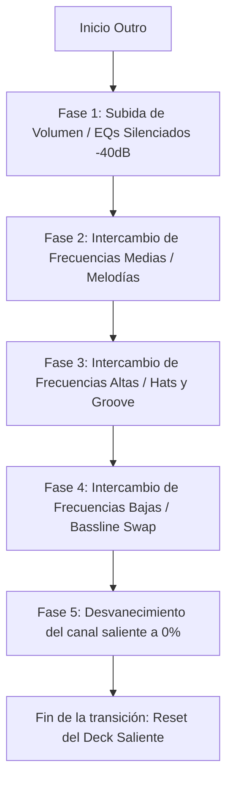

# Moodsic Web Auto-DJ 🎧
> Mezclador de audio inteligente y motor Auto-DJ autónomo en tiempo real, ejecutado completamente en el navegador mediante Web Audio API y React.

Moodsic es una aplicación web interactiva de DJ que permite cargar archivos de música locales (o pistas de demostración) para analizarlos en tiempo real y realizar transiciones armónicas automáticas o manuales entre dos decks independientes (Deck A y Deck B). 

El sistema utiliza Procesamiento de Señales Digitales (DSP) en el lado del cliente para detectar el tempo (BPM), la tonalidad musical (Camelot Code), y los puntos óptimos de entrada (Intro/Drop) y salida (Outro). Con esta información, el motor Auto-DJ sincroniza los beats de las pistas y ejecuta una mezcla fluida de 5 fases controlando volúmenes y ecualizaciones (EQs).

---

## 📋 Tabla de Contenidos
- [Características Clave](#-características-clave)
- [Pila Tecnológica](#-pila-tecnológica)
- [Cómo Funciona Bajo el Capó (DSP y Análisis de Audio)](#-cómo-funciona-bajo-el-capó-dsp-y-análisis-de-audio)
  - [1. Detección de BPM (Tempo)](#1-detección-de-bpm-tempo)
  - [2. Detección de Tonalidad (Escala Camelot)](#2-detección-de-tonalidad-escala-camelot)
  - [3. Detección de Intro / Drop](#3-detección-de-intro--drop)
  - [4. Detección de Outro](#4-detección-de-outro)
  - [5. Compatibilidad Armónica (Camelot Wheel)](#5-compatibilidad-armónica-camelot-wheel)
- [Motor de Transición de Auto-DJ](#-motor-de-transición-de-auto-dj)
  - [Alineación de Tempo (Pitch Matching)](#alineación-de-tempo-pitch-matching)
  - [Alineación Rítmica (Beat Grid Alignment)](#alineación-rítmica-beat-grid-alignment)
  - [Transición de Ecualización en 5 Fases](#transición-de-ecualización-en-5-fases)
- [Estructura del Proyecto](#-estructura-del-proyecto)
- [Prerrequisitos e Instalación](#-prerrequisitos-e-instalación)
- [Guía de Uso](#-guía-de-uso)
- [Solución de Problemas (Troubleshooting)](#-solución-de-problemas-troubleshooting)

---

## ✨ Características Clave

*   **Doble Reproductor (Decks A & B):** Controladores de reproducción independientes con representación gráfica de la onda de audio (Waveform) renderizada en tiempo real mediante `<canvas>`.
*   **Análisis Local de Audio:** Decodificación y análisis de archivos de audio arrastrados por el usuario, sin enviar datos a ningún servidor (100% privado y veloz).
*   **Análisis Armónico Camelot:** Detecta el tono de la canción y dibuja una rueda visual de compatibilidad armónica en el dashboard lateral.
*   **Motor Auto-DJ Inteligente:** Cuando está activo, monitorea el progreso de la pista en reproducción. Al alcanzar el punto de "Outro", busca una pista compatible en la biblioteca, la carga en el deck libre, sincroniza los BPMs, alinea los ritmos y ejecuta la transición.
*   **Mezclador Manual Completo:**
    *   Ecualizadores rotativos de 3 bandas por canal (Bajos, Medios, Altos).
    *   Fader de pitch/velocidad de alta resolución (rango de ±5%).
    *   Faders de volumen de canal y crossfader de potencia constante (Equal-power curve).
*   **Diseño Visual Premium:** Estética cyberpunk/glassmorphism con un esquema de colores de alta fidelidad (tonos neón cian, rosa y verde) y fuentes de Google Fonts (*Outfit* y *Space Grotesk*).
*   **Consola de Actividades de DJ:** Bitácora en tiempo real que detalla cada paso matemático y lógico del motor de mezclas.

---

## 🛠️ Pila Tecnológica

*   **Biblioteca Principal:** [React 18 (Vite)](https://react.dev/)
*   **Procesamiento de Audio:** Web Audio API (`AudioContext`, `OfflineAudioContext`, `BiquadFilterNode` para EQs, `GainNode` para faders, `AudioBufferSourceNode` para reproducción).
*   **Iconos:** [Lucide React](https://lucide.dev/)
*   **Estilos:** CSS3 vainilla con variables personalizadas, filtros de desenfoque (`backdrop-filter`) y efectos de resplandor neón.
*   **Tipografía:** *Outfit* (títulos e interfaces) y *Space Grotesk* (métrica e indicadores).

---

## 🔬 Cómo Funciona Bajo el Capó (DSP y Análisis de Audio)

El archivo [`src/utils/audioAnalyzer.js`](file:///D:/dev/Moodsic/src/utils/audioAnalyzer.js) es el núcleo analítico de Moodsic. Utiliza matemáticas aplicadas al procesamiento de señales de audio digital:

### 1. Detección de BPM (Tempo)
Para identificar el tempo (BPM) de una pista:
1.  **Downsampling:** Se procesa el audio dentro de un `OfflineAudioContext` remuestreado a **22,050 Hz** para reducir el tamaño del buffer y acelerar los cálculos.
2.  **Aislamiento de Transitorios (Filtro de paso bajo):** Se pasa la señal por un filtro `lowpass` con corte en **150 Hz** y factor Q de 1.0. Esto aísla los golpes del bombo (kick drum), que marcan el ritmo en la música de baile.
3.  **Detección de Picos:** Se busca la amplitud máxima absoluta. Se define un umbral dinámico (60% de dicha amplitud máxima). Los picos que superen este umbral y que estén separados por al menos 0.25 segundos (equivalente a un límite superior de 240 BPM) se registran como golpes rítmicos.
4.  **Histograma de Intervalos:** Se calculan las distancias (en muestras) entre picos consecutivos y se convierten a BPM candidatos. Los BPM se normalizan al rango estándar de DJ (**75 a 150 BPM**) doblando o dividiendo el valor a la mitad. Se construye un histograma y el BPM con mayor ocurrencia (suavizado con los valores adyacentes) se define como el tempo de la canción.

### 2. Detección de Tonalidad (Escala Camelot)
La detección del tono musical permite mezclar armónicamente:
1.  **Hann Windowing & FFT:** Se extraen 8 ventanas de audio del centro de la canción (del 30% al 70% de la duración total) para evitar intros o silencios. A cada ventana de **4096 muestras** se le aplica una función de ventana Hann y se calcula la **Transformada Rápida de Fourier (FFT)** usando un algoritmo Radix-2 Cooley-Tukey implementado en JS puro.
2.  **Extracción de Chromagrama (Vector Chroma):** Para cada bin de frecuencia en el rango audible de instrumentos estándar (50 Hz a 2000 Hz), se calcula la magnitud espectral y se mapea a su respectiva nota MIDI ($f \rightarrow \text{Nota}$). Las energías se acumulan en un vector de 12 elementos (uno por cada semitono de la escala cromática: C, C#, D... B). El vector chroma se normaliza dividiendo cada elemento por el valor máximo.
3.  **Correlación de Perfiles (Krumhansl-Schmuckler):** El vector chroma rotado en las 12 tonalidades posibles se compara contra los vectores de perfil estándar de Krumhansl-Schmuckler para escalas mayores (`KS_MAJOR`) y menores (`KS_MINOR`). Se utiliza el **coeficiente de correlación de Pearson**. La escala con la correlación más alta determina la tonalidad física (ej. *C Minor*).
4.  **Mapeo a Camelot:** La tonalidad física se traduce al código Camelot equivalente (ej. *C Minor* $\rightarrow$ `5A`, *C Major* $\rightarrow$ `8B`) mediante un diccionario de equivalencias (`CAMELOT_MAP`).

### 3. Detección de Intro / Drop
El punto de entrada ("drop") es donde la energía se eleva considerablemente después de un inicio silencioso o progresivo:
*   Se escanean los primeros 60 segundos de la canción dividiéndolos en bloques de 1 segundo.
*   Se calcula la energía cuadrática media (**RMS**) de cada bloque.
*   Se calcula el delta de energía entre bloques consecutivos. El punto de entrada se identifica donde ocurre el mayor incremento positivo de energía (delta), siempre que los siguientes 4 segundos mantengan un nivel de energía por encima del 80% del promedio de la canción (confirmando que no es un pico transitorio).

### 4. Detección de Outro
El punto de salida ("outro") es donde la canción comienza a desvanecerse o perder elementos rítmicos:
*   Se escanean los últimos 2 minutos de la canción en bloques de 1 segundo.
*   Se calcula el **RMS** de cada bloque y se identifica el RMS máximo de esta región final.
*   Se busca (avanzando cronológicamente) el primer bloque donde la energía decae por debajo del **22% del RMS máximo** y se mantiene por debajo del 35% durante el resto del tema. Este punto de caída sostenida se marca como el inicio de la mezcla (Outro).

### 5. Compatibilidad Armónica (Camelot Wheel)
Dos pistas son armónicamente compatibles si sus claves Camelot están correlacionadas en la rueda Camelot. El sistema valida esto en la función [`areKeysCompatible`](file:///D:/dev/Moodsic/src/utils/audioAnalyzer.js#L430-L449):
*   **Misma clave:** ej. `8A` y `8A` (mezcla perfecta).
*   **Claves adyacentes numéricamente:** ej. `8A` y `9A` (subida de energía), `8A` y `7A` (bajada). El sistema contempla la transición circular entre `12` y `1`.
*   **Intercambio relativo Mayor/Menor:** Cambiar la letra manteniendo el mismo número, ej. `8A` (La menor) y `8B` (Do mayor).

---

## 🎛️ Motor de Transición de Auto-DJ

Cuando el reproductor llega al punto de "Outro" de la canción activa, se inicia automáticamente el proceso de transición en segundo plano. La función principal que orquesta esto es [`triggerAutomatedTransition`](file:///D:/dev/Moodsic/src/App.jsx#L293-L515):

### Alineación de Tempo (Pitch Matching)
El motor de mezclas lee los BPM originales de la pista saliente (`fromBpm`) y de la entrante (`toBpm`). Calcula el porcentaje de ajuste de velocidad requerido para igualarlos:
$$\text{pitchOffset} = \frac{\text{fromBpm} - \text{toBpm}}{\text{toBpm}} \times 100$$
Este porcentaje se aplica al fader de pitch del deck entrante y se asigna al nodo de audio: `source.playbackRate.value = 1 + (pitchOffset / 100)`.

### Alineación Rítmica (Beat Grid Alignment)
Para evitar la superposición caótica de bombos (el temido "cabalgamiento" o "trainwreck"):
1.  Se calcula la duración de un beat (en segundos) en base al tempo de la pista activa: `beatDuration = 60 / fromBpm`.
2.  Se obtiene la posición exacta de reproducción con precisión de microsegundos usando el reloj interno del procesador de audio: `elapsed = currentTime - startTime`.
3.  Se calcula el residuo de fase: `beatOffset = highPrecisionTime % beatDuration`.
4.  Se desfasa el arranque del deck entrante para que coincida exactamente con el inicio del siguiente beat: `delay = beatDuration - beatOffset`. El comando `source.start(AudioContext.currentTime + delay)` programa el disparo síncrono.

### Transición de Ecualización en 5 Fases
Una vez que el deck entrante se dispara de forma síncrona, se ejecuta una automatización gradual en 5 etapas iguales a lo largo del tiempo de introducción del nuevo tema:



*   **Fase 1 (Volumen Entrante):** El volumen del canal entrante sube linealmente de 0.0 a 1.0. Sus ecualizadores (EQs) se inicializan totalmente recortados (`low = -40dB`, `mid = -40dB`, `high = -40dB`) para no ensuciar la mezcla.
*   **Fase 2 (Intercambio de Medios):** Las frecuencias medias (donde residen las voces y armonías principales) del deck entrante suben de -40dB a 0dB, mientras que las del deck saliente bajan de 0dB a -40dB.
*   **Fase 3 (Intercambio de Altos):** Los agudos (hi-hats, percusiones brillantes) del deck entrante suben a 0dB y los del saliente caen a -40dB.
*   **Fase 4 (Intercambio de Bajos):** ¡El bajo dominante cambia! Las frecuencias graves (kick, sub-bass) del deck entrante suben a 0dB (normal) y las del deck saliente caen a -40dB.
*   **Fase 5 (Crossover de Volúmenes):** El volumen del canal entrante se mantiene constante en 1.0 (máxima potencia), mientras que el volumen del canal saliente se reduce progresivamente a 0.0, completando la mezcla en el "drop" de la nueva canción.

---

## 📁 Estructura del Proyecto

```
Moodsic/
├── public/                 # Archivos de audio de demostración estáticos
│   ├── house-loop.wav      # Loop de música house (BPM: 125, Key: 8A)
│   ├── electronic-loop.wav # Loop electrónico (BPM: 128, Key: 5A)
│   ├── outfoxing.mp3       # Pista de audio demo
│   └── viper.mp3           # Pista de audio demo
├── src/
│   ├── utils/
│   │   └── audioAnalyzer.js # Utilidades DSP (BPM, FFT, Camelot, RMS)
│   ├── App.jsx             # Interfaz de usuario React y motor de audio Web Audio API
│   ├── index.css           # Estilos de diseño, temas neón y componentes visuales
│   └── main.jsx            # Punto de entrada de la aplicación React
├── index.html              # Estructura base de la SPA e inclusión de fuentes
├── package.json            # Configuración de dependencias y scripts de Vite
└── vite.config.js          # Configuración del servidor de desarrollo de Vite
```

---

## 🚀 Prerrequisitos e Instalación

### Prerrequisitos
*   **Node.js** (versión 18.0 o superior recomendada)
*   **NPM** (incluido con Node) o **Yarn**

### Instalación

1.  **Clonar el repositorio:**
    ```bash
    git clone https://github.com/hector-horta/Moodsic.git
    cd Moodsic
    ```

2.  **Instalar dependencias:**
    ```bash
    npm install
    ```

3.  **Ejecutar el servidor de desarrollo local:**
    ```bash
    npm run dev
    ```

4.  **Abrir el navegador:**
    Navega a la dirección indicada por la consola (generalmente `http://localhost:5173`).

---

## 🎮 Guía de Uso

1.  **Cargar la biblioteca:**
    *   Al entrar por primera vez, haz clic en **"Cargar Demos"** en la barra lateral izquierda para descargar y analizar los loops de demostración incluidos.
    *   También puedes arrastrar y soltar tus propios archivos de música (MP3, WAV, etc.) a la zona de **"Arrastra archivos MP3 o haz clic"**. El analizador de audio tardará unos segundos en detectar sus metadatos armónicos.
2.  **Cargar pistas en los Decks:**
    *   Usa los botones **"Deck A"** y **"Deck B"** junto a cada canción en tu biblioteca para colocarlas en el reproductor correspondiente.
3.  **Activar/Desactivar Auto-DJ:**
    *   En la barra lateral derecha puedes activar el switch **"Auto-DJ Inteligente"**.
    *   Si está activo, el sistema mezclará solo al llegar al final de la pista. Si está apagado, tendrás control manual total sobre el crossfader, los ecualizadores y el lanzamiento de pistas.
4.  **Probar Transición (Test Outro):**
    *   Para no esperar a que termine toda la canción, haz clic en **"Test Outro"** en el deck en reproducción. Esto saltará la línea de tiempo a 5 segundos antes del punto "Outro", permitiéndote escuchar y validar cómo se activa y realiza la transición automática de inmediato.
5.  **Controlar EQ y Crossfader manualmente:**
    *   Puedes hacer clic en los ecualizadores (High, Mid, Low) para alternar valores preestablecidos rápidamente.
    *   Arrastra el **Crossfader** para controlar manualmente la mezcla de volumen entre Deck A (izquierda) y Deck B (derecha).

---

## ⚠️ Solución de Problemas (Troubleshooting)

### 1. Errores de CORS al cargar demos
*   **Problema:** Al hacer clic en "Cargar Demos", la consola muestra bloqueos de origen cruzado (CORS).
*   **Causa:** El navegador bloquea solicitudes fetch a recursos locales si no se accede mediante el protocolo `http://` provisto por el servidor de desarrollo de Vite.
*   **Solución:** Asegúrate de ejecutar la app con `npm run dev` y acceder desde `http://localhost:5173` en lugar de abrir el archivo `index.html` directamente desde el explorador de archivos (`file:///...`). Para saltar cualquier restricción de red, se recomienda arrastrar archivos MP3 locales propios.

### 2. Archivos con protección DRM o formatos no soportados
*   **Problema:** Algunas canciones muestran un error de decodificación al subirse.
*   **Causa:** El decodificador nativo del navegador (`decodeAudioData`) no puede procesar archivos con encriptación DRM (como canciones descargadas directamente de plataformas de suscripción como Apple Music o Spotify) o formatos de audio no estándar.
*   **Solución:** Asegúrate de utilizar archivos de audio limpios y libres de DRM en formato `.mp3`, `.wav`, `.ogg` o `.m4a`.

### 3. Falta de audio al iniciar la aplicación
*   **Problema:** Las canciones parecen reproducirse (la barra de progreso avanza), pero no se escucha sonido.
*   **Causa:** Por políticas de seguridad, los navegadores bloquean la salida de audio hasta que el usuario interactúa con la página (haciendo un clic).
*   **Solución:** Haz clic en cualquier botón de la página (como "Play", o los reguladores de volumen) para activar y desbloquear el contexto de audio (`AudioContext`).
